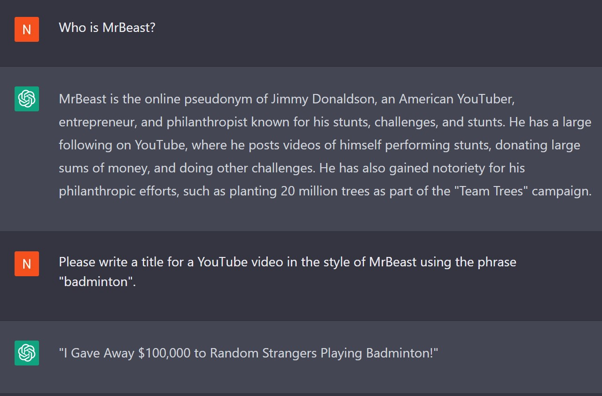

MrBeast Title Generator
=============================
YouTube API + GPT-3 Fine-tuning = Avocado and Bacon 100 Sandwich Challenge!
------------------------------------------------

 In his recent podcast appearances on Joe Rogan and Lex Fridman, MrBeast was asked how he comes up with his video ideas. He answered that after so many years of research and experimentation with the YouTube algorithm, he can easily generate ideas from a single world. For example, Lex provides "space" as inspiration, and MrBeast gave "I Went to Space!" and "Blowing Up a Nuke in Space!" as video titles.  

 I was curious if it might be possible to fine-tune GPT-3 to generate engaging YouTube titles from similar prompts. Here is what I did:  

 1. Using the [YouTube API](https://developers.google.com/youtube/v3), I pulled all MrBeast video titles from his main channel (~750 in total)  
 2. I then extracted the key words with the Noun Phrase Extraction feature in the [TextBlob](https://textblob.readthedocs.io/en/dev/index.html) library  
 3. The result was ~ 1600 prompt-completion pairs, which I manually culled these down to the 200 best  
 4. Using the OpenAI API, I finetuned the text-curie-001 model for ChatGPT  

Here is an example of what GPT-3 using Curie could do prior to the fine-tuning:  

(Note that Curie has no idea who MrBeast is, so I went with a more generic prompt)  

...and here is my model! Given the prompt "badminton", it responds:

Not too bad!  

Here are a couple more examples:
- avocado -> Avocado and Bacon 100 Sandwich Challenge!
- purple -> So I've Been Trying to Get Him to Wear Purple for a Day...
- PewDiePie -> PewdiePie, You're a Joke, Remember You're Just a Millionaire!

Overall, I am pleased with the performance as the fine-tuned model created titles more similar to those of MrBeast than the baseline. To be fair though, ChatGPT knows who MrBeast is and is quite capable of generating video titles of a similar style.

Thanks for reading! For those interested, all the code is on GitHub [here](https://github.com/batterylake/mrbeastgpt).
